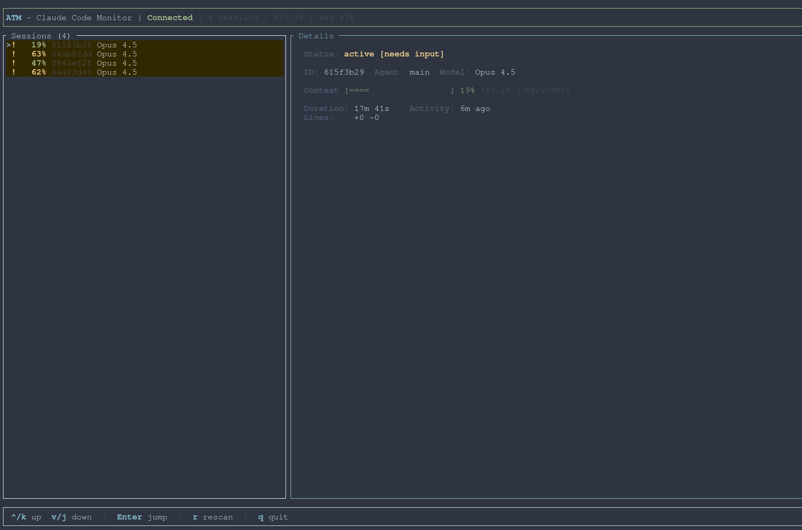

# Agent Tmux Monitor (ATM)

[](https://github.com/damelLP/agent-tmux-monitor/actions)
[](LICENSE)

> **⚠️ Warning:** This software was vibe coded by Claude while the author nodded along approvingly. It works surprisingly well, but if it summons a daemon (the other kind), you're on your own.

**Real-time monitoring for Claude Code agents across tmux sessions.**

Know what your AI agents are doing, before they hit limits.



## Overview

Agent Tmux Monitor provides a centralized, real-time dashboard for monitoring multiple Claude Code sessions. If you're running several Claude Code agents across tmux windows, ATM gives you instant visibility into:

- **Context usage** - See which sessions are approaching context limits
- **Agent status** - Know when agents are thinking, waiting for permission, or idle
- **Cost tracking** - Monitor spending across all sessions
- **Session navigation** - Jump directly to any tmux session with a keypress

## Features

- **Real-time updates** - Status refreshes every ~300ms via Claude Code hooks
- **Keyboard-driven interface** - Familiar TUI with vim-style navigation
- **Split-pane layout** - Overview panel + detailed session view
- **Context progress bars** - Visual indicators for context window usage
- **Tmux integration** - Press Enter to jump directly to any session
- **Zero impact** - Non-blocking hooks that never slow down Claude Code
- **Graceful degradation** - Works even when daemon is temporarily unavailable

## Installation

### Quick Install (Recommended)

```bash
curl -sSL https://raw.githubusercontent.com/damelLP/agent-tmux-monitor/main/scripts/install.sh | sh
```

This downloads pre-built binaries, installs them to `~/.local/bin`, and configures Claude Code hooks automatically.

### Using Cargo

If you have Rust installed:

```bash
# From source
cargo install atm

# Or with pre-built binaries (faster)
cargo binstall atm
```

Then configure the hooks:

```bash
atm setup
```

### Manual Installation

1. Download the latest release for your platform from [GitHub Releases](https://github.com/damelLP/agent-tmux-monitor/releases)

2. Extract and install:
   ```bash
   tar xzf atm-<target>.tar.gz
   cd atm-*
   cp atm atmd atm-hook ~/.local/bin/
   chmod +x ~/.local/bin/atm*
   ```

3. Configure Claude Code hooks:
   ```bash
   atm setup
   ```

### Verify Installation

```bash
# Check binaries are installed
which atm atmd

# Check daemon status
atmd status
```

## Quick Start

1. **Launch ATM**:
   ```bash
   atm
   ```
   (The daemon starts automatically if it's not already running)

2. **Start using Claude Code** - sessions will automatically appear as you work.

## Usage

### Keyboard Controls

| Key | Action |
|-----|--------|
| `j` / `↓` | Move selection down |
| `k` / `↑` | Move selection up |
| `Enter` | Jump to selected tmux session |
| `Tab` | Toggle between panels |
| `q` | Quit |
| `?` | Show help |

### Daemon Commands

```bash
# Start daemon in background
atmd start -d

# Start daemon in foreground (for debugging)
atmd start

# Check daemon status
atmd status

# Stop daemon
atmd stop
```

### TUI Options

```bash
# Launch with default settings
atm

# Pick mode - select a session and exit (useful for scripting)
atm --pick

# Show version
atm --version

# Show help
atm --help
```

### Tmux Popup Integration

Run ATM in a tmux popup for quick session switching without leaving your current window:

```bash
# Add this to your ~/.tmux.conf
bind-key a display-popup -E -w 80% -h 60% "atm --pick"
```

Now press `<prefix>-a` to pop up ATM, select a session, and jump directly to it. The popup closes automatically after selection.

**Tip:** Adjust `-w` (width) and `-h` (height) percentages to your preference.

## Configuration

### Claude Code Hooks

ATM integrates with Claude Code via hooks. The `atm setup` command automatically adds these to `~/.claude/settings.json`:

```json
{
  "hooks": {
    "PreToolUse": [{
      "matcher": "*",
      "hooks": [{ "type": "command", "command": "atm-hook" }]
    }],
    "PostToolUse": [{
      "matcher": "*",
      "hooks": [{ "type": "command", "command": "atm-hook" }]
    }],
    "StatusLine": [{
      "hooks": [{ "type": "command", "command": "atm-hook" }]
    }]
  }
}
```

### Daemon Socket

The daemon listens on a Unix socket at `/tmp/atm.sock`. This can be customized via environment variable:

```bash
ATM_SOCKET=/path/to/custom.sock atmd start -d
```

## Architecture

ATM consists of three components:

```
┌─────────────────┐     ┌─────────────────┐     ┌─────────────────┐
│   Claude Code   │────▶│      atmd       │◀────│       atm       │
│   (+ hooks)     │     │    (daemon)     │     │      (TUI)      │
└─────────────────┘     └─────────────────┘     └─────────────────┘
        │                       │                       │
        │  atm-hook script      │  Unix socket          │  Real-time
        │  reports events       │  /tmp/atm.sock        │  display
        ▼                       ▼                       ▼
```

- **atm-hook** - Shell script that reports Claude Code events to the daemon
- **atmd** - Background daemon that maintains session registry and broadcasts updates
- **atm** - Terminal UI that connects to daemon and displays session status

### Session Lifecycle

1. Claude Code starts → `atm-hook` sends registration to daemon
2. Status updates every ~300ms via StatusLine hook
3. Tool usage reported via PreToolUse/PostToolUse hooks
4. Session marked stale after 90s of inactivity
5. Stale sessions cleaned up automatically

## Requirements

### System Requirements

- **OS**: Linux or macOS (Windows not currently supported)
- **Terminal**: Any terminal with 256-color support
- **tmux**: Required for session jump functionality

### Runtime Dependencies

- `socat` - For Unix socket communication (install via package manager)
- `jq` - For JSON parsing in hook scripts (install via package manager)

Install on Ubuntu/Debian:
```bash
sudo apt install socat jq
```

Install on macOS:
```bash
brew install socat jq
```

Install on Arch Linux:
```bash
sudo pacman -S socat jq
```

## Troubleshooting

### Daemon won't start

Check if another instance is running:
```bash
atmd status
# If stuck, manually remove socket
rm /tmp/atm.sock
```

### Sessions not appearing

1. Verify hooks are configured:
   ```bash
   cat ~/.claude/settings.json | jq '.hooks'
   ```

2. Check that `atm-hook` is in PATH:
   ```bash
   which atm-hook
   ```

3. Test hook manually:
   ```bash
   echo '{"hook_type": "StatusLine"}' | atm-hook
   ```

### TUI shows "Daemon Disconnected"

Start or restart the daemon:
```bash
atmd start -d
```

### High CPU usage

This shouldn't happen with normal usage. If it does:
1. Check number of active sessions (`atmd status`)
2. Restart daemon (`atmd stop && atmd start -d`)
3. File a bug report with logs from `~/.local/state/atm/atm.log`

## Uninstalling

```bash
# Stop daemon
atmd stop

# Remove hooks and binaries
atm uninstall

# Or manually:
rm ~/.local/bin/atm ~/.local/bin/atmd ~/.local/bin/atm-hook
# Remove hooks from ~/.claude/settings.json
```

## Contributing

Contributions are welcome!

### Building from Source

```bash
# Clone repository
git clone https://github.com/damelLP/agent-tmux-monitor.git
cd agent-tmux-monitor

# Build
cargo build --release

# Run tests
cargo test --all

# Binaries are in target/release/
./target/release/atmd start -d
./target/release/atm
```

### Project Structure

```
agent-tmux-monitor/
├── Cargo.toml           # Workspace root, defines both binaries
├── crates/
│   ├── atm-core/        # Shared domain types and logic
│   ├── atm-protocol/    # Wire protocol definitions
│   ├── atm/             # TUI application
│   └── atmd/            # Daemon server
├── scripts/
│   ├── install.sh       # Installation script
│   └── atm-hook         # Claude Code hook script
└── docs/                # Documentation
```

## License

MIT License - see [LICENSE](LICENSE) for details.

## Acknowledgments

- Built with [ratatui](https://github.com/ratatui-org/ratatui) for the terminal UI
- Async runtime powered by [tokio](https://tokio.rs)
- Born from the chaos of managing too many AI agents at once
